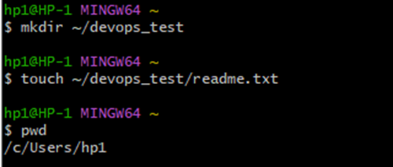
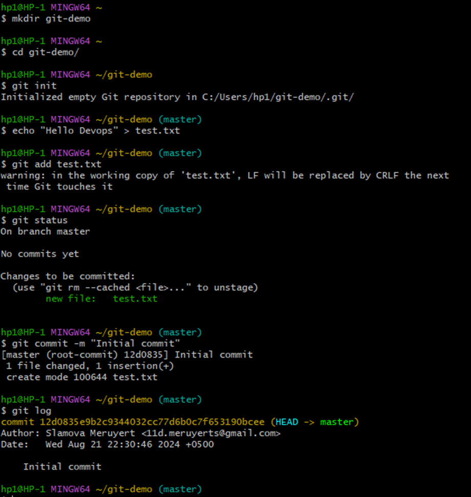
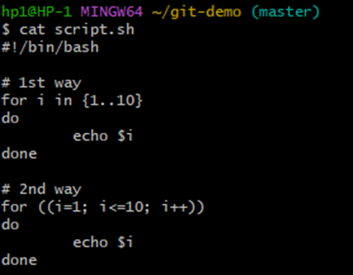
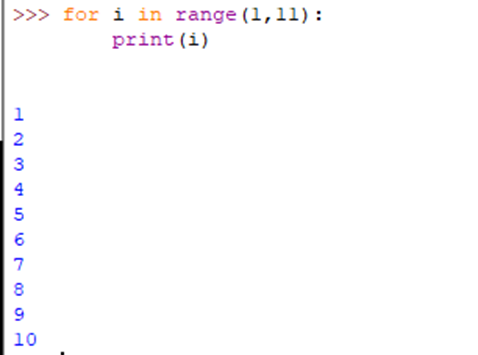

## Тестовое задание. DevOps

#### 1. Основы Linux

###### Задание: Напишите команды для выполнения следующих задач:

- Создание директории devops_test в домашнем каталоге.

```bash
mkdir ~/devops_test
```

- Создание пустого файла readme.txt в созданной директории.

```bash
touch ~/devops_test/readme.txt
```

- Показать текущий путь в терминале.

```bash
pwd
```

#### 2. Основы Git

###### Задание: Выполните следующие действия с использованием Git:

- Создайте новый локальный репозиторий.

```bash
git init
```

- Создайте файл test.txt, добавьте в него текст “Hello DevOps”.

```bash
echo "Hello DevOps" > test.txt
```



- Закоммитьте изменения с сообщением “Initial commit”.

```bash
git add test.txt
git commit -m "Initial commit"
```

- Покажите историю коммитов.

```bash
git log
```



#### 3. Основы сетевых технологий

###### Задание: Ответьте на вопросы:

- Что такое IP-адрес и для чего он используется?

**IP-адрес** (Internet Protocol address) — это такой уникальный номер, который присваивается каждому устройству в сети, который помогает им обмениваться данными через интернет или в локальной сети. Также IP-адрес служит для того, чтобы пакеты данных могли путешествовать от одного устройства к другому, гарантируя, что информация попадет именно туда, куда нужно.

- Назовите основные отличия между протоколами TCP и UDP.

Основные отличия между протоколами TCP и UDP:

- **Надежность**: **_TCP_** надежнее, так как он использует механизмы установления соединения, контроля потерь данных, подтверждения получения данных и повторной передачи данных в случае потерь. А в **_UDP_** такого нет, если пакеты теряются, они не пересылаются повторно.
- **Скорость**: **_TCP_** медленнее, так как он требует дополнительных шагов для установления соединения и обеспечения надежности (например, установка соединения через трехэтапное рукопожатие). **_UDP_** быстрее, поскольку не тратит время на установление соединения и подтверждения доставки.
- **Использование**: **_TCP_** используется для приложений, где важна надежная передача данных, например, для веб-сайтов (HTTP/HTTPS), электронной почты (SMTP), файлового обмена (FTP). **_UDP_** используется в приложениях, где важна скорость передачи и допустима потеря некоторых данных, например, в видеоконференциях, онлайн-играх, потоковом аудио и видео.
- **Контроль потока и перегрузки**: **_TCP_** имеет встроенные механизмы контроля потока и управления перегрузкой, которые помогают избежать переполнения сети. **_UDP_** не имеет таких механизмов, что может привести к потерям данных в случае перегрузки сети.

#### 4. Программирование (Bash или Python)

###### Задание:

• Напишите скрипт на Bash или Python, который выводит числа от 1 до 10
Bash

```bash
#!/bin/bash

# 1st way
for i in {1..10}
do
        echo $i
done

# 2nd way
for ((i=1; i<=10; i++))
do
        echo $i
done
```


Python

```python
for i in range(1, 11):
    print(i)
```



#### 5. Логическое мышление

###### Задание: Решите следующую задачу:

- В одном здании находится три лампочки, управляемые тремя выключателями в другой комнате. Как определить, какой выключатель к какой лампочке относится, если вы можете зайти в комнату с лампочками только один раз?

Чтобы определить какой выключатель управляет какой лампочкой, нужно сделать следующие шаги:

- Включить первый выключатель и подождать немного, чтобы дать лампочке нагреться.
- Включить второй выключатель
- Зайти в комнату с лампами

В итоге, горящая лампа относится ко второму выключателю, теплая лампа к первому, а последняя, холодная к третьему выключателю.
